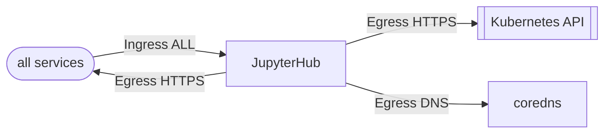

The FluxCD Configuration for [Jupyter Hub](https://jupyter.org/hub). 

## Network Policies

| Direction | Ports/Type | Description |
| --- | --- | --- |
| Ingress | All | Allows all traffic inbound. TODO: This needs to be refined |
| Egress | All | Allows all traffic to egress. TODO: This needs to be refined |
| Egress | TCP/UDP 53 | Allows traffic for DNS ports |
| Egress | HTTPS | Allows access to the kubernetes service to allow Kubernetes API Access |